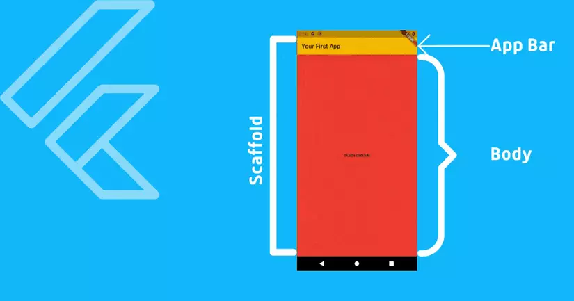
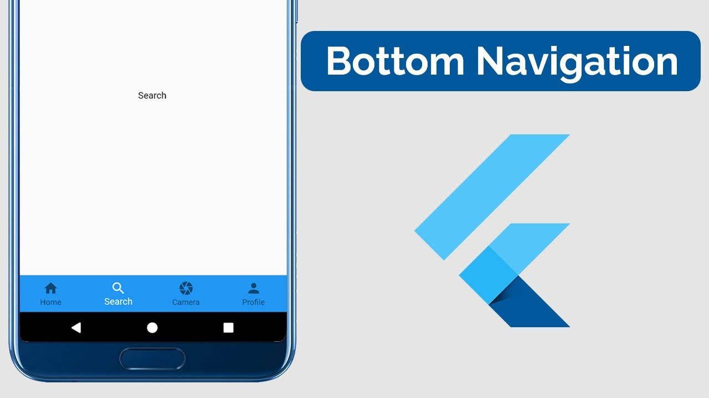
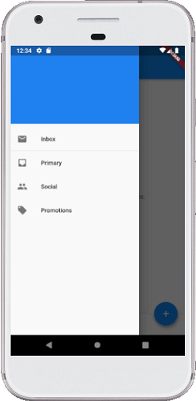

# Danh mục

* [Bài 1: Scaffold](#bài1)
* [Bài 2: Text](#bài2)
* [Bài 3: Icon](#bài3)
* [Bài 4: Image](#bài4)
* [Bài 5: Container](#bài5)
* [Bài 6: SizedBox](#bài6)
* [Bài 7: Divider và VerticalDivider](#bài7)
* [Bài 8: Row và Column](#bài8)
* [Bài 9: Listview](#bài9)

## Bài1
### Scaffold
--> Scaffold là một widget trong Flutter được sử dụng để triển khai cấu trúc bố cục hình ảnh material design cơ bản
```dart
const Scaffold({  
  Key key,  
  this.appBar,  
  this.body,  
  this.floatingActionButton,  
  this.floatingActionButtonLocation,  
  this.persistentFooterButtons,  
  this.drawer,  
  this.endDrawer,  
  this.bottomNavigationBar,  
  this.bottomSheet,  
  this.floatingActionButtonAnimator,  
  this.backgroundColor,  
  this.resizeToAvoidBottomPadding = true,  
  this.primary = true,  
}) 
```
  
  
  
  

## Bài2
### Text

```dart
Text(
        "nội dung",
        maxLines: 1, // số dòng lớn nhất
        overflow: TextOverflow.ellipsis, // đi đôi với maxLines: clip, fade, ellipsis, visible
        textAlign: TextAlign.start, // căn chữ: left, right, center, justify, start, end
        style: TextStyle(
            fontSize: 12.0, // độ lớn của chữ
            color: const Color(0xFFff0909), // màu sắc
            fontWeight: FontWeight.w900, // đậm nhạt
            fontFamily: "Roboto"), // font chữ
      )

```

## Bài3
### Icon

```dart

      Icon(
            Icons.insert_emoticon, // icon
            color: const Color(0xFF000000), // màu sắc
            size: 48.0), // kích thước
    
      )
```

## Bài4
### Image

```dart
Image(
        image: AssetImage('đường dẫn'),
        width: 100, // chiều rộng
        height: 100, // chiều cao
        color: Colors.white, // màu sắc
      )
```

## Bài5
### Container

```dart
Container(
    {Key key,
    AlignmentGeometry alignment,
    EdgeInsetsGeometry padding, // tùy chỉnh căn lề 1 khoảng bên trong nó
    EdgeInsetsGeometry margin, // tùy chỉnh căn lề 1 khoảng bên ngoài nó
    Color color, // màu sắc
    Decoration decoration, // tùy chỉnh hình dạng, bor góc...
    Decoration foregroundDecoration,
    double width, // chiều rộng
    double height, // chiều cao
    BoxConstraints constraints,
    Matrix4 transform,
    Widget child,
    Clip clipBehavior: Clip.none}
)

```
*** Lưu ý: 
Ví dụ: decoration và color không được dùng cùng 1 lúc.
```dart
Container(
        width: 200,
        height: 300,
        decoration: BoxDecoration(
          color: Colors.blue,
          image: DecorationImage(
            fit: BoxFit.fitWidth,
            image: NetworkImage(
              'https://flutter.io/images/catalog-widget-placeholder.png',
            ),
          ),
          border: Border.all(
            width: 10,
            color: Colors.green,
          ),
          borderRadius: BorderRadius.all(
            Radius.circular(20),
          ),
        ),
      )
```

## Bài6
### Container

```dart
const SizedBox(
    {Key key,
    double width, // chiều rộng
    double height, // chiều cao
    Widget child}
)
```

## Bài7
### Divider và VerticalDivider
- Divider: Đường kẻ ngang
```dart
const Divider({
    Key key,
    this.height, // chiều cao
    this.thickness, // chiều dầy
    this.indent, // thụt lề đầu
    this.endIndent, // thụt lề cuối
    this.color, // màu sắc
  })
```
- VerticalDivider: Đường kẻ đứng
```dart
const VerticalDivider({
    Key key,
    this.height, // chiều cao
    this.thickness, // chiều dầy
    this.indent, // thụt lề đầu
    this.endIndent, // thụt lề cuối
    this.color, // màu sắc
  })
```

## Bài8
### Row và Column
```dart
Row(
    {Key key,
    List<Widget> children: const <Widget>[],
    MainAxisAlignment mainAxisAlignment: MainAxisAlignment.start,
    MainAxisSize mainAxisSize: MainAxisSize.max,
    CrossAxisAlignment crossAxisAlignment: CrossAxisAlignment.center,
    TextDirection textDirection,
    VerticalDirection verticalDirection: VerticalDirection.down,
    TextBaseline textBaseline: TextBaseline.alphabetic
    }
)


Column(
    {Key key,
    List<Widget> children: const <Widget>[],
    MainAxisAlignment mainAxisAlignment: MainAxisAlignment.start,
    MainAxisSize mainAxisSize: MainAxisSize.max,
    CrossAxisAlignment crossAxisAlignment: CrossAxisAlignment.center,
    TextDirection textDirection,
    VerticalDirection verticalDirection: VerticalDirection.down,
    TextBaseline textBaseline: TextBaseline.alphabetic
    }
)
```

## Bài9
### Listview
-https://viblo.asia/p/flutter-list-view-va-scrollphysics-cach-nhin-cu-the-07LKXoQJ5V4